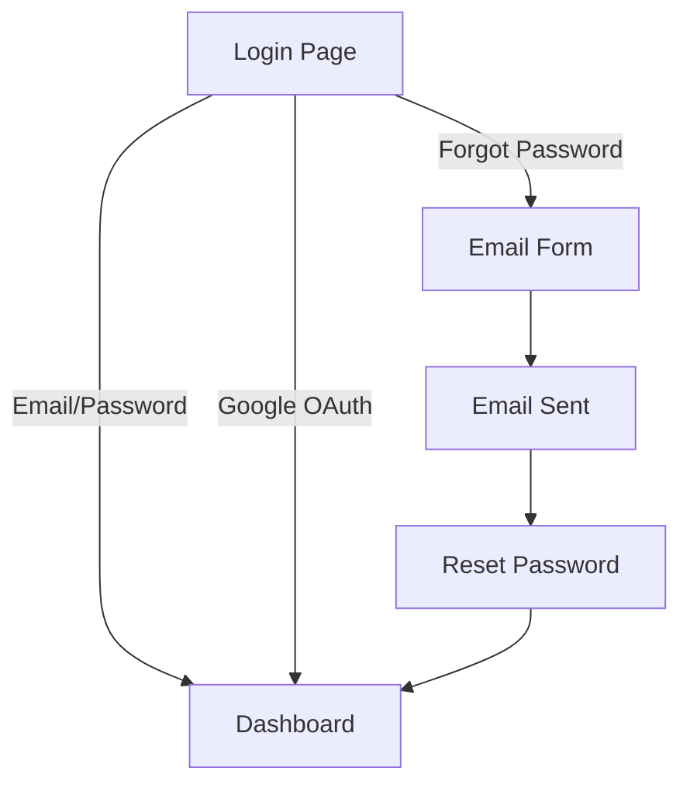

# UX Notes

---

## EPIC-1: User Authentication

### US-1: Email/Password Login
- **Screen:** Login page (`/login`)
- **States:**
  - **Default:** Email + password fields, "Sign In" button
  - **Loading:** Button shows spinner, fields disabled
  - **Error:** Inline error message above form
  - **Success:** Redirect to dashboard
- **Error messages:** Inline, below the relevant field

### US-2: Google OAuth
- **Button:** "Sign in with Google" with Google logo
- **Placement:** Below email/password form, separated by divider "or"

### US-3: Forgot Password
- **Link:** "Forgot password?" below password field
- **Flow:** Login → click link → email form → confirmation → check email → reset form → success

---

## User Flow

