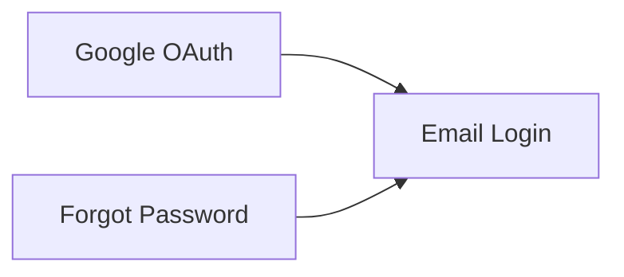

# TokoKita — User Story Map

> Generated: 2026-06-04
> Version: 1.0.0

---

## Project Overview

| Field | Description |
|-------|-------------|
| **Product** | TokoKita — E-commerce Platform |
| **Problem** | Users cannot log in or manage their accounts |
| **Target Users** | Customer (buyer), Admin |
| **Timeline** | Q3 2026 (3 sprints) |
| **Platform** | Web Application |

---

## Table of Contents

| # | Category | File | Description |
|---|----------|------|-------------|
| 1 | Epics | [includes/epics.md](includes/epics.md) | Authentication epic |
| 2 | User Stories | [includes/user-stories.md](includes/user-stories.md) | Login, OAuth, forgot password |
| 3 | Acceptance Criteria | [includes/acceptance-criteria.md](includes/acceptance-criteria.md) | AC per story |
| 4 | BDD Scenarios | [includes/bdd-scenarios.md](includes/bdd-scenarios.md) | Login success, error, lockout |
| 5 | Technical Notes | [includes/technical-notes.md](includes/technical-notes.md) | JWT, OAuth, rate limiting |
| 6 | UX Notes | [includes/ux-notes.md](includes/ux-notes.md) | Login page, reset flow |
| 7 | Glossary | [includes/glossary.md](includes/glossary.md) | JWT, OAuth, SSO |

---

## Quick Reference

| ID | Epic | Priority | Stories | Link |
|----|------|----------|---------|------|
| EPIC-1 | User Authentication | Must | US-1, US-2, US-3 | [details](includes/epics.md) |

### Story Count

| Status | Count |
|--------|-------|
| **Total Stories** | 3 |
| Must Have | 2 |
| Should Have | 1 |

---

## Dependencies

## Glossary

| Term | Definition |
|------|------------|
| JWT | JSON Web Token for session management |
| OAuth | Open standard for token-based authentication |
| SSO | Single Sign-On |
