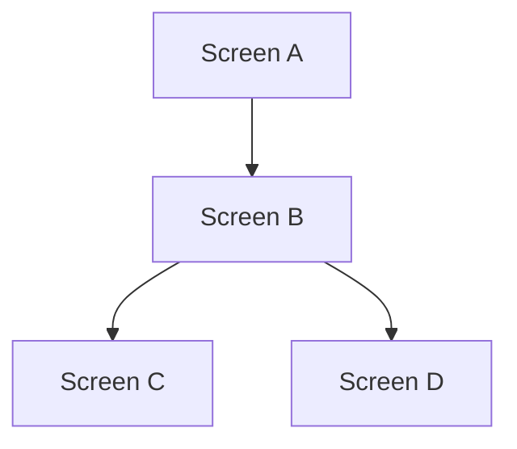
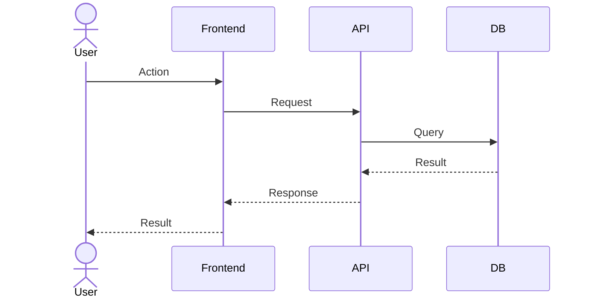

# UX Notes

---

## Design Principles

- {principle 1}
- {principle 2}

---

## EPIC-1: {Epic Title}

### US-1: {Story Title}
- **Screen:** {screen/page name}
- **States:** loading, empty, error, success
- **Interaction:** {click, swipe, type...}
- **Accessibility:** {keyboard nav, screen reader...}

### US-2: {Story Title}
- **Screen:** {screen/page name}
- **States:** loading, empty, error, success

---

## User Flow (Mermaid)

## Sequence Diagram (Mermaid)

---

## Design References

- {Figma link or description}
