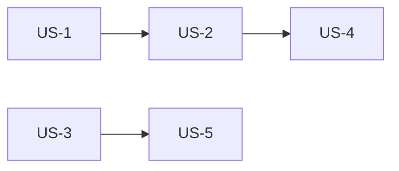

# {Project Name} — User Story Map

> Generated: {date}
> Version: {version}

---

## Project Overview

| Field | Description |
|-------|-------------|
| **Product** | {name} |
| **Problem** | {problem statement} |
| **Target Users** | {roles} |
| **Timeline** | {timeline} |
| **Platform** | {platform} |

---

## Table of Contents

| # | Category | File | Description |
|---|----------|------|-------------|
| 1 | Epics | [includes/epics.md](includes/epics.md) | Epic definitions & business goals |
| 2 | User Stories | [includes/user-stories.md](includes/user-stories.md) | All user stories |
| 3 | Acceptance Criteria | [includes/acceptance-criteria.md](includes/acceptance-criteria.md) | AC per story |
| 4 | BDD Scenarios | [includes/bdd-scenarios.md](includes/bdd-scenarios.md) | Gherkin scenarios |
| 5 | Technical Notes | [includes/technical-notes.md](includes/technical-notes.md) | Architecture & constraints |
| 6 | UX Notes | [includes/ux-notes.md](includes/ux-notes.md) | Design & UX decisions |
| 7 | Decision Log | [includes/decision-log.md](includes/decision-log.md) | Architectural & product decisions |
| 8 | Revision History | [includes/revision-history.md](includes/revision-history.md) | Version history & changelog |
| 9 | Glossary | [includes/glossary.md](includes/glossary.md) | Domain terms |

---

## Traceability Matrix

| Epic ID | Story ID | AC ID | BDD Scenario ID | Priority | Complexity |
|---------|----------|-------|-----------------|----------|------------|
| EPIC-1 | US-1 | AC-1, AC-2, AC-3 | SC-1.1, SC-1.2 | Must | 3 |
| EPIC-1 | US-2 | AC-4, AC-5 | SC-2.1 | Should | 5 |
| EPIC-2 | US-3 | AC-6 | — | Could | 2 |

*Full details: [Epics](includes/epics.md) · [Stories](includes/user-stories.md) · [AC](includes/acceptance-criteria.md) · [BDD](includes/bdd-scenarios.md)*

---

## Quick Reference

| ID | Epic | Priority | Complexity | Stories | Link |
|----|------|----------|------------|---------|------|
| EPIC-1 | {name} | Must | 3, 5, 2 | US-1, US-2, US-3 | [details](includes/epics.md) |
| EPIC-2 | {name} | Should | 5 | US-4, US-5 | [details](includes/epics.md) |

### Story Count

| Status | Count |
|--------|-------|
| **Total Stories** | {N} |
| Must Have | {N} |
| Should Have | {N} |
| Could Have | {N} |

### Complexity Distribution

| Complexity (Points) | Count |
|---------------------|-------|
| 1 (Trivial) | {N} |
| 2 (Simple) | {N} |
| 3 (Medium) | {N} |
| 5 (Large) | {N} |
| 8 (Very Large) | {N} |

---

## Dependencies Map

---

## Glossary

_{Key terms defined here — full glossary in [includes/glossary.md](includes/glossary.md)}_
